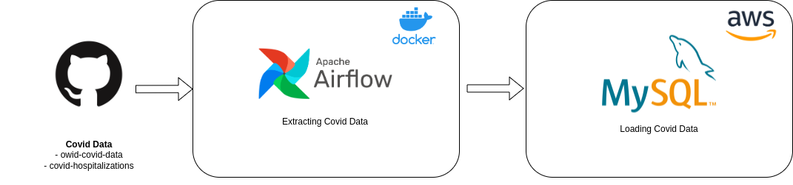
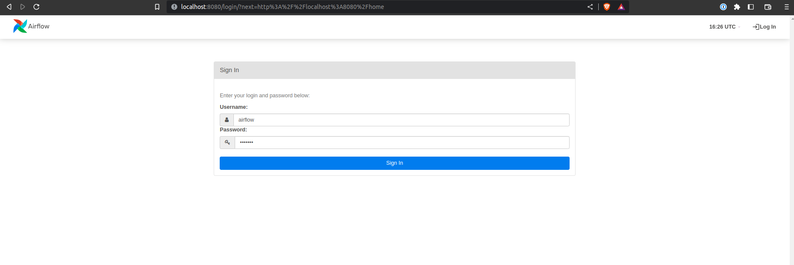
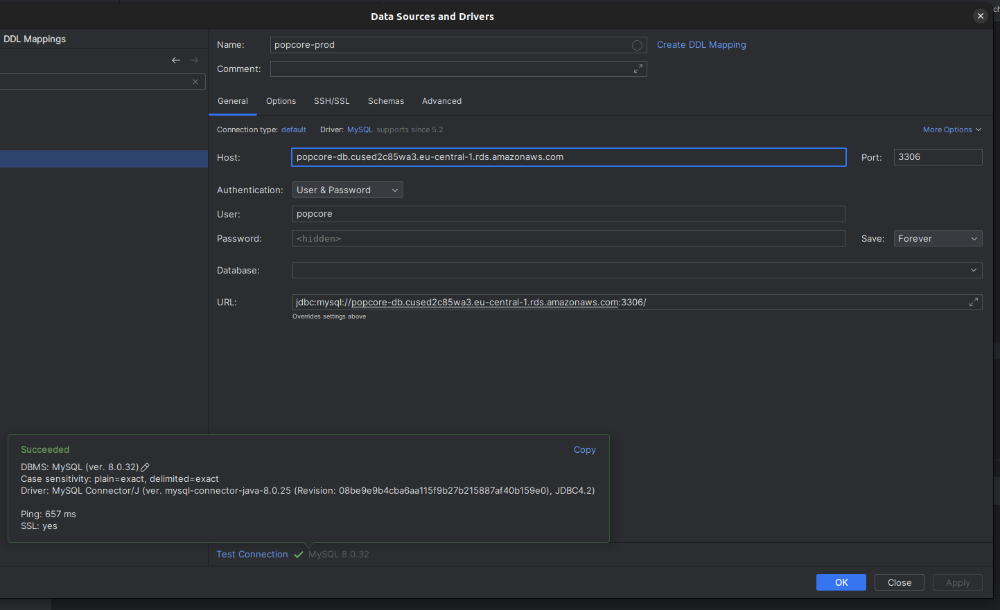

# Popcore Challenge

## Setup
To tackle this challenge I decided to use Airflow as a workflow manager. I have used it in the past and I think it is a great tool for this kind of task. I have also used Docker to make the setup easier. For the database I decided to go with MySQL on AWS because it is a service that I am familiar with and it is easy to setup. For the deployment I used terraform in order to have a reproducible infrastructure, versioning and to be able to scale it easily if needed (Plus I can be sure to delete everything without being charged after the challenge is completed).



### Airflow
In order to get started you create a virtual environment and install the requirements.
```bash
python3 -m venv venv
source venv/bin/activate
pip install -r requirements.txt
```
Then you start the Airflow server with docker compose (if you haven't installed docker compose you can find more information [here](https://docs.docker.com/compose/)). 
```bash
cd airflow
docker compose up -d
```
You can access the UI at http://localhost:8080 (username and password are both 'airflow'). We can see that the server is running and that the DAG is paused.


### MySQL
In order to access the MySQL database you can use the credentials stored in the `.env` file. If you're for example using DataGrip you can create a new connection and it should look like this:


The two tables are in the `popcore` database:
```sql
select * from owid_covid_data limit 5;
select * from covid_hospitalizations limit 5;
```

